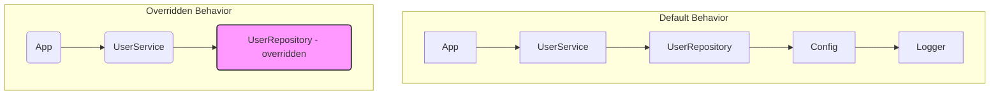

import { Editor } from '../../../components/editor';

`@favy/di` is a lightweight, TypeScript-powered tool that makes dependency injection effortless. It lets you build modular, composable functionality with zero boilerplate—just write functions and focus on your logic while it handles the rest.
Ideal for building streamlined, testable, and future-proof applications.

---

## Motivation

Most dependency injection libraries are overly complex, requiring excessive boilerplate. With `@favy/di`, managing dependencies is as simple as writing a function.

Powered by TypeScript, it automatically `infers dependencies` based on what your function uses—no explicit declarations needed. Dependencies are passed through an `ambient context`, so you can focus on business logic instead of infrastructure.

Each module is `just a function` that takes an object, making it flexible, intuitive, and `easy` to use anywhere. Build clean, testable, and maintainable applications without unnecessary overhead.

## Install:

```sh frame="none"
npm install @favy/di
```

```sh frame="none"
yarn add @favy/di
```

```sh frame="none"
pnpm add @favy/di
```

```sh frame="none"
bun add @favy/di
```

## Setting Up a Simple Module

A module is defined using the Module function:

<Editor client:only code={`import { Module } from '@favy/di';

const Ready = Module()('Ready', () => console.log('Server ready!'));

console.log(Ready()); // Output: "Server ready!"`}></Editor>

## Defining Parameters

You can define modules that accept parameters:

<Editor client:only code={`import { Module } from '@favy/di';

interface AddOneCtx {
\tnumber: number;
}
const AddOne = Module<AddOneCtx>()('AddOne', ({ number }) => number + 1);

console.log(AddOne({ number: 5 })); // Output: 6
`}/>

## Composing Modules

Modules can be composed to depend on other modules dynamically. Here’s an example:

<Editor client:only code={`import { Module, Live } from '@favy/di';

const A = Module()('A', () => 10);
type ALive = Live<typeof A>;

const B = Module()('B', () => 20);
type BLive = Live<typeof B>;

const Sum = Module<ALive & BLive>()('Sum', ({ A, B }) => A + B);

console.log(Sum({ A, B })); // Output: 30
`}/>

## Dependency Injection

Modules support dynamic dependency injection, allowing for highly composable functionality:

<Editor client:only code={`import { Module, Live } from '@favy/di';

const Random = Module()('Random', () => ({
\tgenerate: () => Math.random(),
}));
type RandomLive = Live<typeof Random>;

const App = Module<RandomLive>()('App', ({ Random }) => {
\treturn 'Random value: ' + Random.generate();
},
);

console.log(App({ Random })); // Output: "Random value: 0.1234..."

// You can override the dependency at any level
console.log(App({
\tRandom: {
\t\tgenerate: () => 4,
\t}
})) // Output: "Random value: 4"
`}/>

# Deep Dependency Replacement in Module Architecture

This example demonstrates how to replace dependencies at any depth level within a modular application structure. The implementation shows the flexibility of replacing deep-level dependencies without modifying the higher-level modules.

## Module Structure

The application consists of five hierarchical levels:

1. Logger (Base level)
2. Config
3. UserRepository
4. UserService
5. App (Top level)

## Demonstrated Capability

The implementation shows how to:

- Replace a deep-level dependency (UserRepository) while keeping all other modules intact
- Maintain the full functionality of the application while using the replaced dependency
- Preserve type safety when replacing modules

The example specifically demonstrates replacing the UserRepository with a test implementation and the Logger with a no-op version, showing that dependencies can be replaced regardless of their position in the module hierarchy.

The diagram visualizes both the standard module connections and how the system works with replaced dependencies, while the code shows the practical implementation.



### Code

```ts
import { Module, Live } from '@favy/di';\

// src/logger.ts Level 1: Logging
const Logger = Module()('Logger', () => ({
  log: (message: string) => console.log('[Log]: ' + message),
}));
type LoggerLive = Live<typeof Logger>;

// src/config.ts Level 2: Configuration
const Config = Module<LoggerLive>()('Config', ({ Logger }) => ({
  get: (key: string) => {
    Logger.log('Fetching config for key: ' + key);
    return 'value-of-' + key;
  },
}));
type ConfigLive = Live<typeof Config>;

// src/user-repository.ts Level 3: Data repository
const UserRepository = Module<ConfigLive>()('UserRepository', ({ Config }) => ({
  findUser: (id: number) => {
    const dbName = Config.get('dbName');
    return { id, name: 'User-' + id, db: dbName };
  },
}));
type UserRepositoryLive = Live<typeof UserRepository>;

// src/user-service.ts Level 4: Service
const UserService = Module<UserRepositoryLive>()(
  'UserService',
  ({ UserRepository }) => ({
    getUserProfile: (id: number) => {
      const user = UserRepository.findUser(id);
      return { ...user, profile: 'Profile-of-' + user.name };
    },
  })
);
type UserServiceLive = Live<typeof UserService>;

// src/app.ts Level 5: App
const App = Module<UserServiceLive>()('App', ({ UserService }) => ({
  start: () => {
    const profile = UserService.getUserProfile(1);
    return 'App started with user profile: ' + profile.profile;
  },
}));

// Usage with default dependencies
console.log(
  App({
    Logger,
    Config,
    UserRepository,
    UserService,
  }).start()
);
// Output: "App started with user profile: Profile-of-User-1"

// Overriding dependencies
console.log(
  App({
    // Override the logging module to do nothing
    Logger: { log: (message: string) => ({}) },
    Config,
    // Override the data repository to return test data
    UserRepository: {
      findUser: (id: number) => ({
        id,
        name: 'Test-' + id,
        db: 'Test-DB',
      }),
    },
    UserService,
  }).start()
);
// Output: "App started with user profile: Profile-of-Test-1"
```

## Discover More

Explore our comprehensive documentation to discover the full power of the module system, including advanced features, real-world examples, and best practices for building scalable applications.
