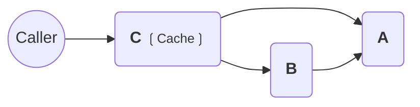
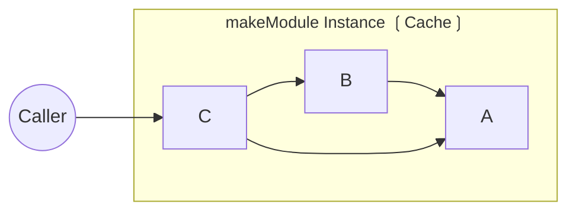

import { Editor } from '../../../components/editor';

Below is a concise overview of how caching works in makeModule. The cache option determines when and how often a module is recomputed. It can be set to one of the following values:

## cache = 'run' (default)

Each module is computed once per “run.” If you call the same module multiple times within one run, its value is reused. Upon a new run (or after certain resets), the module is computed again.

<Editor client:only code={`import { Module, Live } from '@favy/di';
// Default: cache = 'run'
let i = 0;
const A = Module()('A', () => ++i);
type ALive = Live<typeof A>;

const B = Module<ALive>()('B', ({ A }) => A);
type BLive = Live<typeof B>;

const C = Module<ALive & BLive>()('C', ({ A, B }) => A + B);

C({ A, B }); // 2 because A was computed once (1 + 1)
C({ A, B }); // 4 because A was computed again (2 + 2)
`} />

## cache = 'module'

The result is computed only once per module’s lifetime. Repeated calls to the same module within that lifetime return the same cached value.

<Editor client:only code={`import { makeModule, Live } from '@favy/di';

const Module = makeModule({
\tcache: 'module',
});

let i = 0;
const A = Module()('A', () => ++i);
type ALive = Live<typeof A>;

const B = Module<ALive>()('B', ({ A }) => A);
type BLive = Live<typeof B>;

const C = Module<ALive & BLive>()('C', ({ A, B }) => A + B);

C({ A, B }); // 2 because A was computed once (1 + 1)
C({ A, B }); // 2 because A is not recomputed (still 1 + 1)
`} />

## cache = 'none'

No caching at all. Each time you call a module, it runs the computation anew.

<Editor client:only code={`
import { makeModule, Live } from '@favy/di';

const Module = makeModule({
\tcache: 'none',
});

let i = 0;
const A = Module()('A', () => ++i);
type ALive = Live<typeof A>;

const B = Module<ALive>()('B', ({ A }) => A);
type BLive = Live<typeof B>;

const C = Module<ALive & BLive>()('C', ({ A, B }) => A + B);

C({ A, B }); // 3 because A was called twice (1 + 2)
C({ A, B }); // 7 because A was called ag
`} />

Use cache according to your application’s needs:
• run (default) — Cache the result for each run.
• module — Cache the result for the entire module lifetime.
• none — Never cache; recompute on every call.
